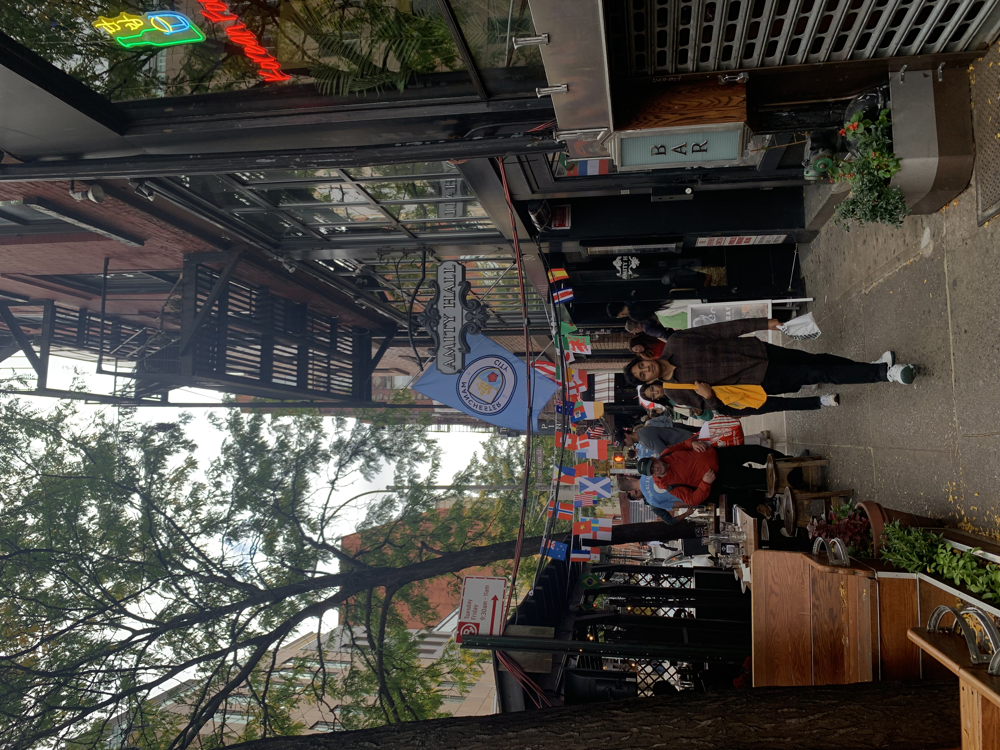

# This is Jeff's awesome website


# Plot on website

```{r plot}
library(tidyverse)
plot_df = tibble(x = runif(100), y = 1+2*x+rnorm(100))
plot_df |> ggplot(aes(x = x, y = y)) + geom_point()
```

# Link to other website

This is a [link](http://www.google.com/) to a good data science tool.

Here is a link to [p8105](https://p8105.com/index.html).

Here is a link to the [about](about.html) page.


# New section: include picture

There is an image of mancity bar in NY.

